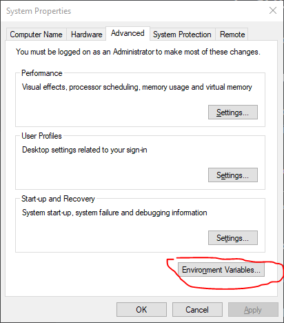

# 1. Setup

We need to install git, follow the instructions [here](https://git-scm.com/book/en/v2/Getting-Started-Installing-Git). NB: The rest of this tutorial assumes you are in a powershell terminal

## 1.1. Setup command line

We need to install some powershell utilities to ensure we can see what is going on in git repositories, by executing the following commands we can install posh-git which will show which branch you are currently in.

```powershell
(new-object Net.WebClient).DownloadString("https://raw.githubusercontent.com/psget/psget/master/GetPsGet.ps1") | iex
Install-Module posh-git
Add-PoshGitToProfile
```

### 1.1.1. Troubleshooting command not found

If, when trying to execute any git command, you need to update the path variable for windows. To do that perform the following steps

1. Find out where git is installed
   1. It will either be `C:\Program Files\Git` or `c:\Users\<Username>\AppData\Local\Programs\Git`
2. Open the start menu
3. Search for "Edit the system environment variables"
4. Select Environment Variables 
   
5. From "User variables for <User>" select "Path"
6. Select "Edit"
7. Select "New"
8. Enter the path where git was installed with `\cmd` on the end
9. Restart your pc (Logging out and back in might be enough, but why risk it)

## 1.2. One-time global configuration settings

Run the following commands to ensure that git is configured correctly on your machine

**Fig 1** Git config commands

```
git config --global user.name "Your Name"
git config --global user.email your.email@example.com
git config --global init.defaultBranch main
```

## 1.3. Exercises

1. Run `git help` at the command line. What is the first command listed?
2. There’s a chance that the full output of `git help` was too big to fit in your terminal, with most of it just scrolling by. The windows command line should support scrolling back to read this
3. Git stores global configuration settings in a hidden text file located in your home directory. By inspecting the file `c:\Users\<USERNAME>\.gitconfig` with a tool of your choice, confirm that the configuration set up by Listing 1.3 corresponds to simple text entries in this file.

# 2. Initializing the repo

Now it’s time to start creating a project and put it under version control with Git. To see how Git works and what benefits it brings, it helps to have a concrete application in mind, so we’ll be tracking changes in a simple project consisting of a small website consisting of two pages, a Home page and an About page.[6](https://www.learnenough.com/git-tutorial#cha-1_footnote-6) We’ll begin by making a directory with the generic name `website` inside a repositories directory called `repos`:

```
[~]$ mkdir repos\website
```

Here we’ve used the “make directory” command `mkdir` creates intermediate directories as required (in this case, `repos`). Note also that I’ve included the current directory in the prompt (in this case, `[~]`) this is so you can see where you are expected to be, ~ is shorthand for your home directory

After making the directory, we can `cd` into it as follows:

```
[~]$ cd repos\website
[website]$
```

(You can use tab completion when changing directories, so in real life I would probably type something like `cd re⇥w⇥`.)

Even though the `website` directory is empty, we can already convert it to a *repository*, which you can think of as a sort of enhanced directory with the additional ability to track changes to every file and subdirectory. The way to create a new repository with Git is with the `init` command (short for “initialize”), which creates a special directory called `.git` where Git stores the information it needs to track our project’s changes. (It’s the presence of a properly configured `.git` directory that distinguishes a Git repository from a regular directory.)

All Git commands consist of the command-line program `git` followed by the name of the command, so the full command to initialize a repository is `git init`, as shown below

**Fig 2:** Initializing a Git repository.

```
[website]$ git init
Initialized empty Git repository in /Users/mhartl/repos/website/.git/
[website (main)]$
```

## 2.1. Exercises

1. By running `ls`, list the files and directories in your `website` directory. What is the name of the hidden directory used by the Git repository? (There is one such hidden directory per project.)
2. Using the result of the previous exercise, run `ls` on the hidden directory and guess the name of the main Git configuration file. Use `type` to dump its contents to the screen. 

# 3. Our first commit

Git won’t let us complete the initialization of the repository while it’s empty, so we need to make a change to the current directory. We’ll make a more substantive change in a moment, but for now we’ll follow a common convention and simply use `New-Item` to create an empty file. In this case, we’re making a simple website, and the [near-universal convention](https://en.wikipedia.org/wiki/Webserver_directory_index) is to call the main page `index.html`:

```
[website (main)]$ New-Item index.html
```

Having created this first file, we can use the `git status` command to see the result:

```
[website (main)]$ git status
On branch main

No commits yet

Untracked files:
  (use "git add <file>..." to include in what will be committed)
        index.html

nothing added to commit but untracked files present (use "git add" to track)
```

We see here that the `index.html` file is “untracked”, which means Git doesn’t yet know about it. We can *add* it using the `git add` command:

```
[website (main)]$ git add -A
```

Here the `-A` option tells Git to add *all* untracked files, even though in this case there’s only one. In my experience, 99% of the time you add files you’ll want to add them all, so this is a good habit to cultivate, and learning how to add individual files is left as an exercise ([Section 1.3.1](https://www.learnenough.com/git-tutorial#sec-exercises_our_first_commit)). (By the way, the [nearly equivalent](https://stackoverflow.com/questions/572549/difference-between-git-add-a-and-git-add) command `git add .`, where the dot refers to the [current directory](https://www.learnenough.com/r/learn_enough_command_line/directories/navigating_directories#sec-navigating_directories), is also common.)[8](https://www.learnenough.com/git-tutorial#cha-1_footnote-8)

We can see the result of `git add -A` by running `git status` again:

```
[website (main)]$ git status
On branch main

No commits yet

Changes to be committed:
  (use "git rm --cached <file>..." to unstage)
        new file:   index.html
```

As implied by the word “unstage”, the status of the file has been promoted from *untracked* to *staged*, which means the file is ready to be added to the repository. *Untracked/unstaged* and *staged* are two of the four states commonly used by Git, as shown in [Figure 1.1](https://www.learnenough.com/git-tutorial#fig-git_status_sequence). ([Technically](https://m.xkcd.com/1475/), untracked and unstaged are different states, but the distinction is rarely important because `git add` tracks and stages files at the same time.)

**Fig 3:** The main Git status sequence for a changing file


As shown in Fig 3, after putting changes in the staging area we can make them part of the local repository by *committing* them using `git commit`. (We’ll cover the final step from , `git push` later) Most uses of `git commit` use the command-line option `-m` to include a *message* indicating the purpose of the commit. In this case, the purpose is to initialize the new repository, which we can indicate as follows:

```
[website (main)]$ git commit -m "Initialize repository"
[main (root-commit) 44c52d4] Initialize repository
 1 file changed, 0 insertions(+), 0 deletions(-)
 create mode 100644 index.html
```

(I’ve shown my output here for completeness, but your details will vary.)

By design, Git requires every commit to include a *commit message* describing the purpose of the commit. Typically, this takes the form of a single line, usually limited to around 72 characters, with an optional longer message if desired. Although conventions for commit messages vary (as humorously depicted in the [xkcd](https://xkcd.com/) comic strip “[Git Commit](https://m.xkcd.com/1296/)”), the style adopted in this tutorial is to write commit messages in the *present tense* using the [*imperative mood*](http://en.wikipedia.org/wiki/Imperative_mood), as in “Initialize repository” rather than “Initializes repository” or “Initialized repository”. The reason for this convention is that Git models commits as a series of text transformations, and in this context it makes sense to describe what each commit *does* instead of what it did. Moreover, this usage agrees with the convention followed by the commit messages generated by Git commands themselves (e.g., “merge” rather than “merges” or “merged”). For more information, see the GitHub article “[Shiny new commit styles](https://github.blog/2011-09-06-shiny-new-commit-styles/)”.

At this point, we can use `git log` to see a record of our commit:

```
[website (main)]$ git log
commit 44c52d432d294ef52bae5535dc6dcb0993175a04 (HEAD -> main)
Author: Michael Hartl <michael@michaelhartl.com>
Date:   Thu Apr 1 10:30:38 2021 -0700

    Initialize repository
```

The commit is identified by a *hash*, which is a unique string of letters and numbers that Git uses to label the commit and which lets Git retrieve the commit’s changes. In my case, the hash appears as

```
44c52d432d294ef52bae5535dc6dcb0993175a04
```

but since each hash is unique your result will differ. The hash is often referred to as a “SHA” (pronounced *shah*) because of the acronym for the [Secure Hash Algorithm](https://en.wikipedia.org/wiki/SHA-1) used to generate it. We put these SHAs to use in more advanced Git usage such as recovering from errors, and several more advanced Git operations require them as well.

## 3.1 Exercises

1. Using the `New-Item` command, create empty files called `foo` and `bar` in your repository directory.
2. By using `git add foo`, add `foo` to the staging area. Confirm with `git status` that it worked.
3. Using `git commit -m` and an appropriate message, add `foo` to the repository.
4. By using `git add bar`, add `bar` to the staging area. Confirm with `git status` that it worked.
5. Now run `git commit` *without* the `-m` option. Use your [Vim knowledge](https://www.learnenough.com/r/learn_enough_text_editor/vim/mvv#sec-mvv) to add the message “Add bar”, save, and quit. (Hint: I to insert, )
6. Using `git log`, confirm that the commits made in the previous exercises worked correctly.

# 4. Viewing the diff

It’s often useful to be able to view the changes represented by a potential commit before making it. To see how this works, let’s add a little bit of content to `index.html` by [redirecting the output](https://www.learnenough.com/r/learn_enough_command_line/manipulating_files/redirecting_and_appending#sec-redirecting_and_appending) of `echo` to make a “hello, world” page:

```
[website (main)]$ echo "hello, world" > index.html
```

Git has a diff function, `git diff`, which by default just shows the difference between the last commit and unstaged changes in the current project:

```
[website (main)]$ git diff
diff --git a/index.html b/index.html
index e69de29..4b5fa63 100644
--- a/index.html
+++ b/index.html
@@ -0,0 +1 @@
+hello, world
```

Because the content added in **Section 3** was empty, here the diff appears simply as an addition:

```
+hello, world
```

We can commit this change by passing the `-a` option (for “all”) to `git commit`, which arranges to commit all the changes in currently existing files ([Listing 1.5](https://www.learnenough.com/git-tutorial#code-git_commit_a_m)).

```
[website (main)]$ git commit -a -m "Add content to index.html"
[main 64f6529] Add content to index.html
 1 file changed, 1 insertion(+)
```

Note that the `-a` option includes changes only to files already added to the repository, so when there are new files it’s important to run `git add -A` as in **Section 3** to make sure they’re added properly. It’s easy to get in the habit of running `git commit -a` and forget to add new files explicitly; learning how to deal with this situation is left as an exercise

Having added and committed the changes, there’s now no diff:

```
[website (main)]$ git diff
[website (main)]$
```

(In fact, simply adding the changes is sufficient; running `git add -A` would also lead to there being no diff. To see the difference between staged changes and the previous version of the repo, use `git diff --staged`.)

We can confirm that the change went through by running `git log`:

```
[website (main)]$ git log
commit 64f6529494cb0e193f05b0da75702feef854e176
Author: Michael Hartl <michael@michaelhartl.com>
Date:   Thu Apr 1 10:33:24 2021 -0700

    Add content to index.html

commit 44c52d432d294ef52bae5535dc6dcb0993175a04
Author: Michael Hartl <michael@michaelhartl.com>
Date:   Thu Apr 1 10:30:38 2021 -0700

    Initialize repository
```

## 4.1. Exercises

1. Use `New-Item` to create an empty file called `baz`. What happens if you run `git commit -am "Add baz"`?
2. Add `baz` to the staging area using `git add -A`, then commit with the message `"Add bazz"`.
3. Realizing there’s a typo in your commit message, change `bazz` to `baz` using `git commit --amend`.
4. Run `git log` to get the SHA of the last commit, then view the diff using `git show <SHA>` to verify that the message was amended properly.

# 5. Adding a HTML tag

We’ve now seen all of the major elements involved in the simplest Git workflow, so in this section and the next we’ll review what we’ve done and see how everything fits together. We’ll err on the side of making more frequent commits, representing relatively modest changes, but this isn’t necessarily how you should work in real life. Still, it’s an excellent foundation, and it will give you a solid base on which to build your own workflow and development practices.

One common issue when learning Git involves figuring out when to make a commit. Unfortunately, there’s no simple answer, and real-life usage varies considerably (as illustrated in the [xkcd](https://xkcd.com/) comic strip “[Git Commit](https://m.xkcd.com/1296/)”). My best advice is to make a commit whenever you’ve reached a natural stopping point, or when you’ve made enough changes that you’re starting to worry about losing them. In practice, this can lead to inconsistent results, and it’s common to work for a while and make a large commit and then make a minor unrelated change with a small commit. This mismatch between commit sizes can seem a little weird, but it’s a difficult situation to avoid.

Many teams (including most open-source projects) have their own conventions for commits, including the practice of *squashing* commits to combine them all into one commit for convenience. (this is exactly the kind of thing you can learn about by [Googling for it](https://www.google.com/search?q=git+squash+commits).) In these circumstances, I recommend following the conventions adopted by the project in question.

More than anything, don’t worry about it too much. “[Git Commit](https://m.xkcd.com/1296/)” is a only slight exaggeration, and in any case deciding when to commit is the kind of thing that you’ll invariably get better at with time and experience.

As in previous sections, we’ll be working on the main `index.html` file. Let’s start by opening this file in both a text editor and a web browser. My preferred method for doing this is at the command line using the `atom` and `open` commands (though the latter works only on macOS):

```
[website (main)]$ notepad.exe index.html
```

You can open the directory using a graphical file browser and double-clicking the file to open it in the default file explorer. However you open the file, the results should appear approximately as shown in below


Figure 1.2: Viewing `index.html` in a filesystem browser.


Figure 1.3: The initial HTML file opened in Atom.


Figure 1.4: The initial HTML file viewed in a web browser.

At this point, we’re ready to make a change, which is to promote “hello, world” from ordinary text to a top-level (Level 1) heading. In HTML, the language of the World Wide Web, the way to do this is with a *tag*—in this case, the Level 1 header tag `h1`. Most browsers set `h1` tags in a large font, so the text `hello, world` should look bigger when we’re done. To make the change, replace the current contents of `index.html` with the contents shown in [Listing 1.6](https://www.learnenough.com/git-tutorial#code-hello_world_h1). (In this and all other examples of editing text, you’ll learn more if you type in everything by hand instead of copying and pasting.)

Fig 6: A top-level heading.

```
<h1>hello, world</h1>
```

Fig 6, shows the basic structure used by most HTML tags. First, there’s an *opening tag* that looks like `<h1>`, where the angle brackets `<` and `>` surround the tag name (in this case, `h1`). After the content, there’s a *closing tag* that’s the same as the opening tag, except with an extra slash after the opening angle bracket: `</h1>`. (Note that, as with addresses on the World Wide Web, this is a *slash*, not a *backslash* (a common confusion humorously referenced in the [xkcd](https://xkcd.com/) comic strip “[Trade expert](https://m.xkcd.com/727/)”).)

Upon refreshing the web browser, the index page should appear something like. As promised, the font size of the text for the top-level heading is bigger (and bolder, too).


Figure 1.5: The result of adding an `h1` tag.

As before, we’ll run `git status` and `git diff` to learn more about what we’re going to commit to Git, though with experience you’ll come to run these commands only when necessary. The status simply indicates that `index.html` has been modified:

```
[website (main)]$ git status
Changes not staged for commit:
  (use "git add <file>..." to update what will be committed)
  (use "git restore <file>..." to discard changes in working directory)
        modified:   index.html

no changes added to commit (use "git add" and/or "git commit -a")
```

Meanwhile, the diff shows that one line has been deleted (indicated with `-`) and another added (indicated with `+`):

```
[website (main)]$ git diff
diff --git a/index.html b/index.html
index 4b5fa63..45d754a 100644
--- a/index.html
+++ b/index.html
@@ -1 +1 @@
-hello, world
+<h1>hello, world</h1>
```

As with the Unix `diff` utility, modified sections of code or markup are shown as close to each other as possible so that it’s clear at a glance what changed.[9](https://www.learnenough.com/git-tutorial#cha-1_footnote-9)

At this point, we’re ready to commit our changes. In [Listing 1.5](https://www.learnenough.com/git-tutorial#code-git_commit_a_m) we used both the `-a` and `-m` options to commit **a**ll pending changes while adding a commit **m**essage, but in fact the two can be combined as `-am` ([Listing 1.7](https://www.learnenough.com/git-tutorial#code-git_commit_am)).

**Listing 1.7:** Committing with `-am`.

```
[website (main)]$ git commit -am "Add an h1 tag"
```

Using the `-am` combination as in [Listing 1.7](https://www.learnenough.com/git-tutorial#code-git_commit_am) is common in idiomatic Git usage.

### [**1.5.1**Exercises](https://www.learnenough.com/git-tutorial#sec-exercises_adding_a_tag)

1. The `git log` command shows only the commit messages, which makes for a compact display but isn’t particularly detailed. Verify by running `git log -p` that the `-p` option shows the full diffs represented by each commit.
2. Under the `h1` tag in [Listing 1.6](https://www.learnenough.com/git-tutorial#code-hello_world_h1), use the `p` tag to add a *paragraph* consisting of the line “Call me Ishmael.” The result should appear as in [Figure 1.6](https://www.learnenough.com/git-tutorial#fig-ishmael_paragraph). (Don’t worry if you get stuck; we’ll incorporate the answer to this exercise in [Section 1.6](https://www.learnenough.com/git-tutorial#sec-adding_html_structure) ([Listing 1.8](https://www.learnenough.com/git-tutorial#code-html_structure)).)


Figure 1.6: The result of adding a short paragraph.

## [**1.6**Adding HTML structure](https://www.learnenough.com/git-tutorial#sec-adding_html_structure)

Although the web browser correctly rendered the `h1` tag in [Figure 1.5](https://www.learnenough.com/git-tutorial#fig-hello_world_h1), properly formatted HTML pages have more structure than just bare `h1` or `p` tags. In particular, each page should have an `html` tag consisting of a *head* and a *body* (identified with `head` and `body` tags, respectively), as well as a “doctype” identifying the document type, which in this case is a particular version of HTML called HTML5. (Don’t worry about these details now; we’ll cover them in more depth in [*Learn Enough HTML to Be Dangerous*](https://www.learnenough.com/html).)

Applying these general considerations to `index.html` leads to the full HTML structure shown in [Listing 1.8](https://www.learnenough.com/git-tutorial#code-html_structure). This includes the `h1` tag from [Listing 1.6](https://www.learnenough.com/git-tutorial#code-hello_world_h1) and the paragraph tag from [Figure 1.6](https://www.learnenough.com/git-tutorial#fig-ishmael_paragraph). (The `title` tag, included inside the `head` tag, is empty, but in general every page should have a title, and adding one for `index.html` is left as an exercise ([Section 1.6.1](https://www.learnenough.com/git-tutorial#sec-exercises_adding_html_structure)).)

**Listing 1.8:** The HTML page with added structure.

```
 1<!DOCTYPE html>
 2<html>
 3  <head>
 4    <title></title>
 5  </head>
 6  <body>
 7    <h1>hello, world</h1>
 8    <p>Call me Ishmael.</p>
 9  </body>
10</html>
```

Because this is a lot more content than our previous iteration ([Listing 1.6](https://www.learnenough.com/git-tutorial#code-hello_world_h1)), it’s a good idea to go through it line by line:

1. The document type declaration
2. Opening `html` tag
3. Opening `head` tag
4. Opening and closing `title` tags
5. Closing `head` tag
6. Opening `body` tag
7. Top-level heading
8. Paragraph from the exercises ([Section 1.5.1](https://www.learnenough.com/git-tutorial#sec-exercises_adding_a_tag))
9. Closing `body` tag
10. Closing `html` tag

As usual, we can see the changes represented by our addition using `git diff` ([Listing 1.9](https://www.learnenough.com/git-tutorial#code-diff_html_structure)).

**Listing 1.9:** The diff for adding HTML structure.

```
[website (main)]$ git diff
diff --git a/index.html b/index.html
index 4b5fa63..afcd202 100644
--- a/index.html
+++ b/index.html
@@ -1 +1,10 @@
-<h1>hello, world</h1>
+<!DOCTYPE html>
+<html>
+  <head>
+    <title></title>
+  </head>
+  <body>
+    <h1>hello, world</h1>
+    <p>Call me Ishmael.</p>
+  </body>
+</html>
```

Despite the extensive diffs in [Listing 1.9](https://www.learnenough.com/git-tutorial#code-diff_html_structure), there are hardly any user-visible differences ([Figure 1.7](https://www.learnenough.com/git-tutorial#fig-html_structure)); the only change from [Figure 1.6](https://www.learnenough.com/git-tutorial#fig-ishmael_paragraph) is a small amount of space above the top-level heading. The structure is much better, though, and brings our page nearly into compliance with the HTML5 standard. (It’s not quite valid, because a nonblank page title is required by the standard; fixing this issue is left as an exercise ([Section 1.6.1](https://www.learnenough.com/git-tutorial#sec-exercises_adding_html_structure)).)


Figure 1.7: Adding HTML structure makes hardly any difference in the appearance.

Since we haven’t added any files, using `git commit -am` suffices to commit all the changes ([Listing 1.10](https://www.learnenough.com/git-tutorial#code-commit_html_structure)).

**Listing 1.10:** The commit to add the HTML structure.

```
[website (main)]$ git commit -am "Add some HTML structure"
```

### [**1.6.1**Exercises](https://www.learnenough.com/git-tutorial#sec-exercises_adding_html_structure)

1. Add the title “A whale of a greeting” to `index.html`. Browsers differ in how they display titles; the result in Safari is shown in [Figure 1.8](https://www.learnenough.com/git-tutorial#fig-page_title). (As of this writing, Safari doesn’t display the title unless there are at least two tabs, which is why there’s a second tab in [Figure 1.8](https://www.learnenough.com/git-tutorial#fig-page_title).)
2. Commit the new title with a commit message of your choice. Verify using `git log -p` that the change was committed as expected.
3. By pasting the contents of [Listing 1.8](https://www.learnenough.com/git-tutorial#code-html_structure) into an [HTML validator](https://validator.w3.org/#validate_by_input), verify that it is *not* (quite) a valid web page.
4. Using the validator, verify that the current `index.html` (with nonblank page title) *is* valid.


Figure 1.8: The page title displayed in a browser.

## [**1.7**Summary](https://www.learnenough.com/git-tutorial#sec-summary_getting_started)

Important commands from this section are summarized in [Table 1.1](https://www.learnenough.com/git-tutorial#table-getting_started).

| **Command**          | **Description**                              | **Example**                    |
| -------------------- | -------------------------------------------- | ------------------------------ |
| `git help`           | Get help on a command                        | `$ git help push`              |
| `git config`         | Configure Git                                | `$ git config --global …`      |
| `mkdir -p`           | Make intermediate directories as necessary   | `$ mkdir -p repos/website`     |
| `git status`         | Show the status of the repository            | `$ git status`                 |
| `New-Item <name>`    | Create empty file                            | `$ New-Item foo`               |
| `git add -A`         | Add all files or directories to staging area | `$ git add -A`                 |
| `git add <name>`     | Add given file or directory to staging area  | `$ git add foo`                |
| `git commit -m`      | Commit staged changes with a message         | `$ git commit -m "Add thing"`  |
| `git commit -am`     | Stage and commit changes with a message      | `$ git commit -am "Add thing"` |
| `git diff`           | Show diffs between commits, branches, etc.   | `$ git diff`                   |
| `git commit --amend` | Amend the last commit                        | `$ git commit --amend`         |
| `git show <SHA>`     | Show diff vs. the SHA                        | `$ git show fb738e…`           |
